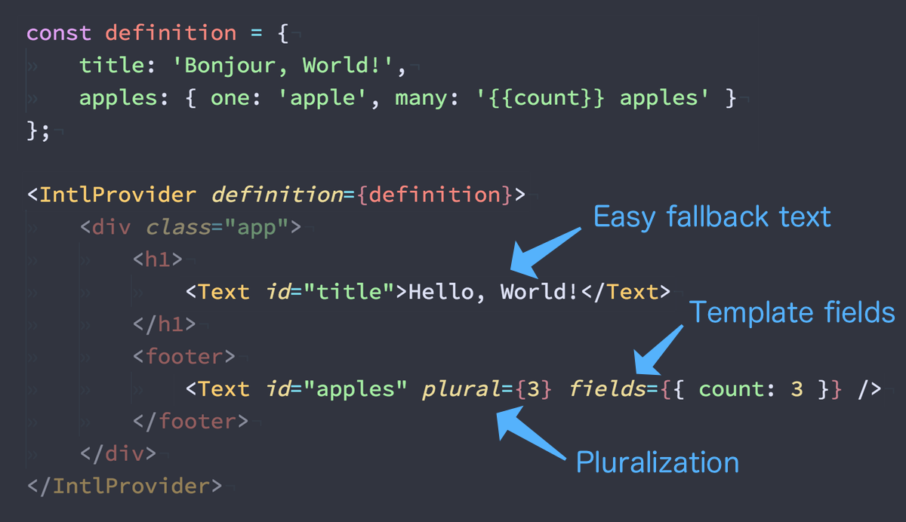

# preact-i18n 🌎 [](https://npm.im/preact-i18n) [](https://travis-ci.org/synacor/preact-i18n) [](https://app.fossa.io/projects/git%2Bgithub.com%2Fsynacor%2Fpreact-i18n?ref=badge_shield)



**Simple localization for Preact.**

-   Tiny: about 1.3kb gzipped
-   Supports dictionary and key scopes/namespaces while maintaining a global dictionary
-   Supports nested dictionaries:
    -   Wrap your component in a default dictionary and scope key
    -   Wrap it again later on (in an app!) to override the defaults
-   Supports pluralization of strings using nested objects.
-   Supports template `{{fields}}` in definition values
-   Has a companion [ESLint plugin](https://www.npmjs.com/package/eslint-plugin-preact-i18n) to help catch bugs early

* * *

-   [Installation](#installation)   
-   [Getting Started](#getting-started)   
    -   [Fallback Text](#fallback-text)   
    -   [Pluralization and Templating](#pluralization-and-templating)   
-   [ESLint Plugin](#eslint-plugin)
-   [API](#api)   

<!-- /MDTOC -->

## Installation

```sh
npm install --save preact-i18n
```

## Getting Started

1.  Create a definition. Typically JSON files, we'll call ours `fr.json`:

```json
{
	"news": {
		"title": "Nouvelles du Monde",
		"totalStories": {
			"none": "Aucun article",
			"one": "Un article",
			"many": "{{count}} articles"
		}
	}
}
```

2.  Expose the definition to your whole app via `<IntlProvider>`:

```js
import { IntlProvider } from 'preact-i18n';
import definition from './fr.json';

render(
	<IntlProvider definition={definition}>
		<App />
	</IntlProvider>
);
```

3.  Use `<Text />` to translate string literals:

```js
import { Text } from 'preact-i18n';

// Assume the "stories" prop is a list of news stories.
const App = ({ stories=[] }) => (
	<div class="app">
		<h1>
			{/* Default fallback text example: */}
			<Text id="news.title">World News</Text>
		</h1>
		<footer>
			{/* Pluralization example: */}
			<Text
				id="news.totalStories"
				plural={stories.length}
				fields={{
					count: stories.length
				}}
			/>
		</footer>
	</div>
);
```

That's it!

### Fallback Text

Rendering our example app with an empty definition _(or without the Provider)_ will attempt to use any text contained within `<Text>..</Text>` as fallback text.

In our example, this would mean rendering without a definition for `news.title` would produce `<h1>World News</h1>`.

If we provide a definition that has a `title` key inside a `news` object, that value will be rendered instead.

### Pluralization and Templating

In our example, `<footer>` is using `<Text>` as a convenient way to do pluralization and templating. In our definition, `news.totalStories` is an Object with pluralization keys. The values in that object will be selected based on an integer `plural` prop passed to `<Text>`.

Any definition value _(including pluralization values)_ can contain `{{field}}` placeholders. These placeholders get replaced with matched keys in an object passed as the `fields` prop.  In our example, the "many" plural form is such a template - it will render `"5 articles"` when `fields={{ count: 5 }}`.

The available forms for specifying pluralization values are as follows:

-   `"key": { "singular":"apple", "plural":"apples" }`
-   `"key": { "none":"no apples", "one":"apple", "many":"apples" }`
-   `"key": ["apples", "apple"]`

Taking `<Text id="news.totalStories" ..>` from our example:

-   `<.. plural={0}>` renders `Aucun article` _(no articles)_
-   `<.. plural={1}>` renders `Un article` _(one article)_
-   `<.. plural={2} fields={{ count: 2 }}>` renders `2 articles`
-   `<.. plural={3} fields={{ count: 3 }}>` renders `3 articles`

In addition to [`<Text>`](#Text), [`withText()`](#withText) and [`<Localizer>`](#Localizer) provide ways to translate more than just display text - HTML attributes, component props, arbitrary Strings, etc.

## ESLint Plugin

A companion ESLint plugin exists, [eslint-plugin-preact-i18n](https://www.npmjs.com/package/eslint-plugin-preact-i18n), which has several rules that help spot common issues like un-i18n'd text, misconfigured tags, and missing keys, that are beneficial in spotting defects early and ensuring that your application is properly i18n'd.

* * *

## API

<!-- Generated by documentation.js. Update this documentation by updating the source code. -->

#### Table of Contents

-   [IntlProvider](#intlprovider)
    -   [Parameters](#parameters)
    -   [Examples](#examples)
-   [Localizer](#localizer)
    -   [Parameters](#parameters-1)
    -   [Examples](#examples-1)
-   [MarkupText](#markuptext)
    -   [Parameters](#parameters-2)
    -   [Examples](#examples-2)
-   [Text](#text)
    -   [Parameters](#parameters-3)
    -   [Examples](#examples-3)
-   [withText](#withtext)
    -   [Parameters](#parameters-4)
    -   [Examples](#examples-4)
-   [intl](#intl)
    -   [Parameters](#parameters-5)

### IntlProvider

`<IntlProvider>` is a nestable internationalization definition provider.
It exposes an Intl scope & definition into the tree,
making them available to descendant components.

> **Note:** When nested, gives precedence to keys higher up the tree!
> This means lower-level components can set their defaults by wrapping themselves
> in an `<IntlProvider>`, but still remain localizable by their parent components.

#### Parameters

-   `props`  
    -   `props.scope` **[String](https://developer.mozilla.org/docs/Web/JavaScript/Reference/Global_Objects/String)?** Nest `definition` under a root key, and set the active scope for the tree (essentially prefixing all `<Text />` keys).
    -   `props.mark` **[Boolean](https://developer.mozilla.org/docs/Web/JavaScript/Reference/Global_Objects/Boolean)** If `true`, all `<Text>` elements will be shown with a red/green background indicating whether they have valid Intl keys. (optional, default `false`)
    -   `props.definition` **[Object](https://developer.mozilla.org/docs/Web/JavaScript/Reference/Global_Objects/Object)** Merge the given definition into the current intl definition, giving the _current_ definition precedence (i.e., only adding keys, acting as defaults) (optional, default `{}`)

#### Examples

```javascript
// generally imported from a JSON file:
let definition = {
	foo: 'Le Feux'
};

<IntlProvider scope="weather" definition={definition}>
	<Text key="foo">The Foo</Text>
</IntlProvider>

// This will render the text:
"Le Feux"
```

### Localizer

`<Localizer />` is a Compositional Component.
It "renders" out any `<Text />` values in its child's props.

#### Parameters

-   `props` **[Object](https://developer.mozilla.org/docs/Web/JavaScript/Reference/Global_Objects/Object)** 
    -   `props.children` **[Object](https://developer.mozilla.org/docs/Web/JavaScript/Reference/Global_Objects/Object)** Child components with props to localize.
-   `context` **[Object](https://developer.mozilla.org/docs/Web/JavaScript/Reference/Global_Objects/Object)** 
    -   `context.intl` **[Object](https://developer.mozilla.org/docs/Web/JavaScript/Reference/Global_Objects/Object)** [internal] dictionary and scope info

#### Examples

```javascript
<Localizer>
	<input placeholder={<Text id="username.placeholder" />} />
</Localizer>
// produces:
<input placeholder="foo" />
```

```javascript
<Localizer>
	<abbr title={<Text id="oss-title">Open Source Software</Text>}>
		<Text id="oss">OSS</Text>
	</abbr>
</Localizer>
// produces:
<abbr title="Open Source Software">OSS</abbr>
```

### MarkupText

`<MarkupText>` is just like [Text](#text) but it can also contain html markup in rendered strings.  It wraps its contents in a `<span>` tag.

#### Parameters

-   `props` **[Object](https://developer.mozilla.org/docs/Web/JavaScript/Reference/Global_Objects/Object)** props
    -   `props.id` **[String](https://developer.mozilla.org/docs/Web/JavaScript/Reference/Global_Objects/String)** Key to look up in intl dictionary, within any parent scopes (`$scope1.$scope2.$id`)
    -   `props.fields` **[Object](https://developer.mozilla.org/docs/Web/JavaScript/Reference/Global_Objects/Object)** Values to inject into template `{{fields}}` (optional, default `{}`)
    -   `props.plural` **[Number](https://developer.mozilla.org/docs/Web/JavaScript/Reference/Global_Objects/Number)?** Integer "count", used to select plural forms
-   `context` **[Object](https://developer.mozilla.org/docs/Web/JavaScript/Reference/Global_Objects/Object)** 
    -   `context.intl` **[Object](https://developer.mozilla.org/docs/Web/JavaScript/Reference/Global_Objects/Object)** [internal] dictionary and scope info

#### Examples

```javascript
// If there is no dictionary in context..
<MarkupText id="foo"><b>The Foo</b></MarkupText>
// ..produces the vnode:
<span><b>The Foo</b></span>
```

```javascript
// Given a dictionary and some fields..
<IntlProvider definition={{ foo:'Le Feux <b>{{bar}}</b>' }}>
	<MarkupText id="foo" fields={{ bar: 'BEAR' }}>The Foo</MarkupText>
</IntlProvider>
// ..produces the vnode:
<span>Le Feux <b>BEAR</b></span>
```

```javascript
// Within a scope, both `id` and the definition are namespaced..
<IntlProvider scope="weather" definition={{ foo:'Le <a href="http://foo.com">Feux</a>' }}>
	<MarkupText id="foo">The Foo</MarkupText>
</IntlProvider>
// ..produces the vnode:
<span>Le <a href="http://foo.com">Feux</a></span>
```

```javascript
// renders nothing if there is no key match and no fallback
<div><MarkupText /></div>
// ..produces the vnode:
<div/>
```

### Text

`<Text>` renders internationalized text.
It attempts to look up translated values from a dictionary in context.

Template strings can contain `{{field}}` placeholders,
which injects values from the `fields` prop.

When string lookup fails, renders its children as fallback text.

#### Parameters

-   `props` **[Object](https://developer.mozilla.org/docs/Web/JavaScript/Reference/Global_Objects/Object)** props
    -   `props.id` **[String](https://developer.mozilla.org/docs/Web/JavaScript/Reference/Global_Objects/String)** Key to look up in intl dictionary, within any parent scopes (`$scope1.$scope2.$id`)
    -   `props.plural` **[Number](https://developer.mozilla.org/docs/Web/JavaScript/Reference/Global_Objects/Number)?** Integer "count", used to select plural forms
    -   `props.fields` **[Object](https://developer.mozilla.org/docs/Web/JavaScript/Reference/Global_Objects/Object)** Values to inject into template `{{fields}}` (optional, default `{}`)
    -   `props.children`  
-   `context` **[Object](https://developer.mozilla.org/docs/Web/JavaScript/Reference/Global_Objects/Object)** 
    -   `context.intl` **[Object](https://developer.mozilla.org/docs/Web/JavaScript/Reference/Global_Objects/Object)** [internal] dictionary and scope info

#### Examples

```javascript
// If there is no dictionary in context..
<Text id="foo">The Foo</Text>
// ..produces the text:
"The Foo"
```

```javascript
// Given a dictionary and some fields..
<IntlProvider definition={{ foo:'Le Feux {{bar}}' }}>
	<Text id="foo" fields={{ bar: 'BEAR' }}>The Foo</Text>
</IntlProvider>
// ..produces the text:
"Le Feux BEAR"
```

```javascript
// Within a scope, both `id` and the definition are namespaced..
<IntlProvider scope="weather" definition={{ foo:'Le Feux' }}>
	<Text id="foo">The Foo</Text>
</IntlProvider>
// ..produces the text:
"Le Feux"
```

### withText

`@withText()` is a Higher Order Component, often used as a decorator.

It wraps a child component and passes it translations
based on a mapping to the dictionary & scope in context.

#### Parameters

-   `mapping` **([Object](https://developer.mozilla.org/docs/Web/JavaScript/Reference/Global_Objects/Object) \| [Function](https://developer.mozilla.org/docs/Web/JavaScript/Reference/Statements/function) \| [String](https://developer.mozilla.org/docs/Web/JavaScript/Reference/Global_Objects/String))** Maps prop names to intl keys (or `<Text>` nodes).

#### Examples

```javascript
@withText({
	placeholder: 'user.placeholder'
})
class Foo {
	// now the `placeholder` prop is our localized String:
	render({ placeholder }) {
		return <input placeholder={placeholder} />
	}
}
```

```javascript
@withText({
	placeholder: <Text id="user.placeholder">fallback text</Text>
})
class Foo {
	render({ placeholder }) {
		return <input placeholder={placeholder} />
	}
}
```

```javascript
@withText('user.placeholder')
class Foo {
	// for Strings/Arrays, the last path segment becomes the prop name:
	render({ placeholder }) {
		return <input placeholder={placeholder} />
	}
}
```

Works with functional components, too


```javascript
const Foo = withText('user.placeholder')( props =>
	<input placeholder={props.placeholder} />
)
```

getWrappedComponent() returns wrapped child Component


```javascript
const Foo = () => <div/>;
const WrappedFoo = withText('user.placeholer')(Foo);
WrappedFoo.getWrappedComponent() === Foo; // true
```

### intl

Higher-order function that creates an `<IntlProvider />` wrapper component for the given component.  It
takes two forms depending on how many arguments it's given:
It can take a functional form like:
intl(ComponentToWrap, options)

or it can take an annotation form like:

#### Parameters

-   `Child`  
-   `options` **[Object](https://developer.mozilla.org/docs/Web/JavaScript/Reference/Global_Objects/Object)** If there are two arguments, the second argument is Passed as `props` to `<IntlProvider />`
    -   `options.scope`  Nest `definition` under a root key, and set the active scope for the tree (essentially prefixing all `<Text />` keys).
    -   `options.definition`  Merge the given definition into the current intl definition, giving the _current_ definition precedence (i.e., only adding keys, acting as defaults) (optional, default `{}`)

## License

[](https://app.fossa.io/projects/git%2Bgithub.com%2Fsynacor%2Fpreact-i18n?ref=badge_large)
